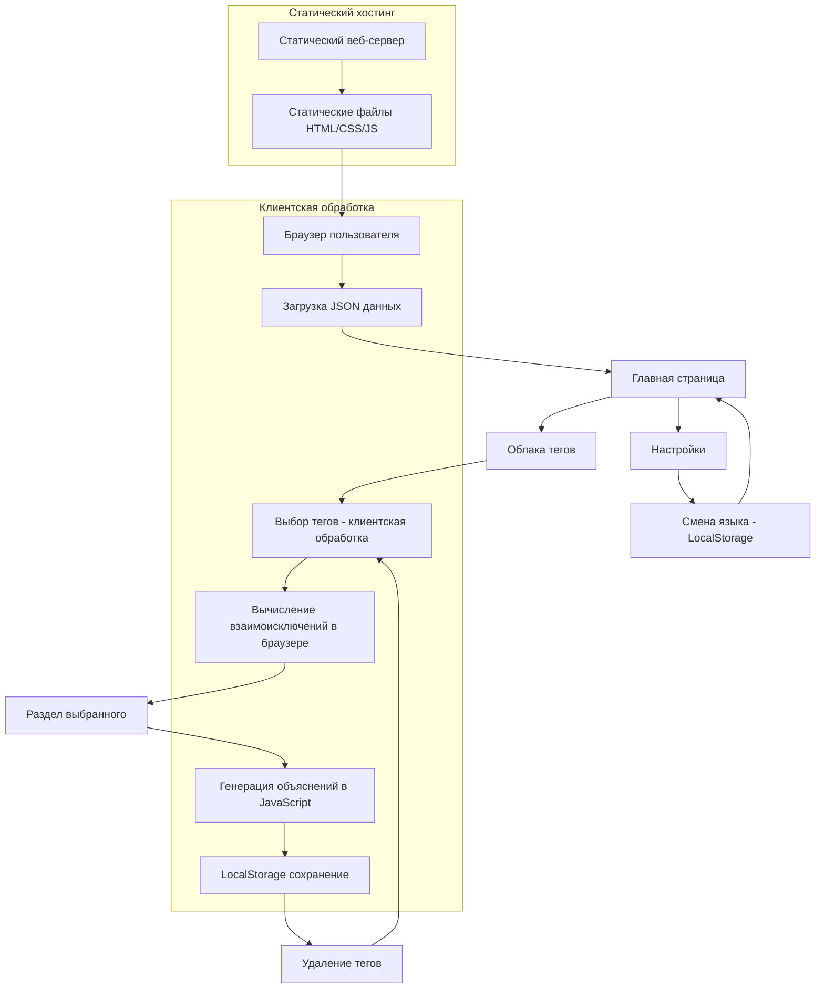

## 1. Product Overview

Минималистичный анализатор совместимости специй - **полностью статическое веб-приложение** с научным обоснованием совместимости специй на основе химических соединений и взаимоисключений.

**КРИТИЧЕСКИ ВАЖНО: 100% Статическое приложение**
- **Только клиентские технологии**: HTML, JavaScript, CSS
- **Полное отсутствие серверной части**: никаких API, баз данных, серверной логики
- **Статические данные**: все данные хранятся в JSON файлах в репозитории
- **Браузерная обработка**: вся логика и вычисления выполняются в браузере
- **Статический хостинг**: развертывается как статические файлы на любом веб-сервере
- **Офлайн работа**: возможность работы без интернета после первой загрузки

Приложение помогает пользователям создавать идеальные смеси специй для различных продуктов и способов приготовления, предоставляя подробное научное обоснование каждого сочетания с описанием конкретных процессов.

Целевая аудитория: домашние повара, профессиональные шеф-повара и любители кулинарии, ценящие научный подход к готовке.

## 2. Core Features

### 2.1 User Roles

**Статическое приложение без пользовательских аккаунтов**

| Role | Registration Method | Core Permissions |
|------|---------------------|------------------|
| Анонимный пользователь | Отсутствует (статическое приложение) | Полный доступ ко всем функциям без регистрации |

**Принципы доступа:**
- Никакой регистрации или аутентификации
- Все функции доступны сразу после загрузки страницы
- Настройки сохраняются локально в браузере (LocalStorage)
- Полная конфиденциальность - никакие данные не передаются на сервер

### 2.2 Feature Module

**Статические страницы приложения (клиентская маршрутизация):**

1. **Главная страница**: интерактивные облака тегов (продукты, способы приготовления, специи), система взаимоисключений, динамические разделы выбранного, подробные научные объяснения - все обрабатывается в браузере
2. **Страница настроек**: переключение языка, информация о приложении - настройки сохраняются в LocalStorage

**Статические принципы:**
- Все страницы генерируются клиентским JavaScript
- Маршрутизация происходит в браузере (Hash Router)
- Данные загружаются из статических JSON файлов
- Никаких серверных запросов после первоначальной загрузки

### 2.3 Page Details

| Page Name | Module Name | Feature description |
|-----------|-------------|---------------------|
| Главная страница | Облако продуктов | Интерактивные теги 15 продуктов с взаимоисключениями (мясо vs рыба, крупы vs овощи) |
| Главная страница | Облако способов готовки | Интерактивные теги 12 методов с взаимоисключениями (сырое vs термообработка, низкие vs высокие температуры) |
| Главная страница | Облако специй | Интерактивные теги 96 специй с цветовой категоризацией и автофильтрацией |
| Главная страница | Раздел выбранного | Динамическое отображение выбранных тегов с возможностью удаления |
| Главная страница | Визуальные индикаторы | Выделение выбранных тегов, затемнение несовместимых, анимации переходов |
| Главная страница | Подробные объяснения | Научные обоснования с описанием конкретных химических процессов и практических результатов |
| Главная страница | Система взаимоисключений | Автоматическая деактивация несовместимых продуктов и методов при выборе |
| Страница настроек | Переключение языка | Поддержка русского и английского языков |
| Страница настроек | Информация | Версия приложения, описание функций |

## 3. Core Process

**Основной пользовательский поток (полностью клиентский):**

1. **Загрузка статического приложения**: пользователь открывает URL приложения, браузер загружает HTML/CSS/JS файлы
2. **Инициализация данных**: JavaScript загружает статические JSON файлы с данными о специях, продуктах и методах
3. **Отображение интерфейса**: браузер рендерит три облака тегов без серверных запросов
4. **Интерактивность (клиентская)**: при каждом выборе тега JavaScript в браузере:
   - Обновляет состояние в памяти браузера
   - Выделяет выбранные теги
   - Вычисляет и затемняет несовместимые теги
   - Показывает раздел с выбранными элементами
5. **Анализ совместимости (браузерный)**: при достаточном выборе JavaScript генерирует объяснения:
   - Анализирует химическую совместимость
   - Рассчитывает процессы при готовке
   - Определяет физические изменения
6. **Локальное сохранение**: все изменения сохраняются в LocalStorage браузера

**Ключевые принципы обработки:**
- Все вычисления происходят в браузере пользователя
- Никаких запросов к серверу после загрузки
- Мгновенная реакция без задержек сети
- Работа в офлайн режиме после первой загрузки

## 4. User Interface Design

### 4.1 Design Style

- **Тёмная тема**: основная тема приложения для комфорта глаз и экономии батареи
- **Основные цвета**: #3b82f6 (яркий синий), #0f172a (тёмный фон), #1e293b (поверхности)
- **Вторичные цвета**: категории специй адаптированы для тёмной темы (травы #4ade80, семена #fbbf24, корнеплоды #fb923c, перцы #ef4444, цветы #ec4899, кора #a3a3a3, ягоды #8b5cf6, орехи #d97706, экзотические #06b6d4, ароматические #7c3aed)
- **Стиль кнопок**: скругленные углы, светящиеся эффекты для активных состояний в тёмной теме
- **Шрифты**: системные шрифты, размеры 14-18px для основного текста, 20-24px для заголовков, высокая контрастность
- **Макет**: карточный дизайн с тёмными поверхностями, облачная компоновка тегов, адаптивная сетка
- **Иконки**: использование эмодзи для категорий (🌿 травы, 🌶️ перцы, 🥜 орехи) с оптимизацией для тёмного фона

### 4.2 Page Design Overview

| Page Name | Module Name | UI Elements |
|-----------|-------------|-------------|
| Главная страница | Облако продуктов | Интерактивные теги с hover-эффектами, выделение выбранных, затемнение несовместимых |
| Главная страница | Облако способов готовки | Интерактивные теги с иконками методов, динамическая фильтрация |
| Главная страница | Облако специй | Цветовая категоризация по типам, автоматическое взаимоисключение |
| Главная страница | Раздел выбранного | Компактные карточки выбранных тегов с кнопками удаления |
| Главная страница | Объяснения совместимости | Раскрывающиеся секции с научным обоснованием |
| Главная страница | Процессы готовки | Динамические описания изменений при выбранном способе |
| Главная страница | Химические процессы | Интерактивные диаграммы молекулярных взаимодействий |
| Страница настроек | Переключатель языка | Toggle-кнопка с флагами стран |

### 4.3 Responsiveness (Статическая адаптивность)

**Клиентская адаптивность без серверной обработки:**
- **Mobile-first подход**: приложение оптимизировано для мобильных устройств
- **CSS медиа-запросы**: адаптация под различные размеры экранов через статический CSS
- **Touch-взаимодействия**: поддержка свайпов и жестов через JavaScript в браузере
- **Прогрессивная загрузка**: статические ресурсы загружаются по приоритету
- **Офлайн-первый дизайн**: интерфейс работает без подключения к интернету

**Статические принципы адаптивности:**
- Все стили определены в CSS файлах
- Никаких серверных запросов для адаптации
- Браузерные API для определения размера экрана
- LocalStorage для сохранения пользовательских предпочтений

## История изменений

### Январь 2025

**Основные обновления:**
- ✅ Обновлено описание с акцентом на минималистичность
- ✅ Добавлена информация о системе взаимоисключений
- ✅ Убраны упоминания брендинга Chi1i Bot
- ✅ Описаны подробные научные обоснования
- ✅ Обновлены количества продуктов (15) и методов (12)
- ✅ Убраны упоминания GitHub Pages хостинга

**Новые функции:**
- **Система взаимоисключений**: Мясо ↔ Рыба, Крупы ↔ Овощи, Молочные ↔ Кислые
- **Подробные научные обоснования**: Описание конкретных химических процессов и механизмов взаимодействия
- **Минималистичный дизайн**: Убраны все элементы брендинга, чистый интерфейс без лишних элементов