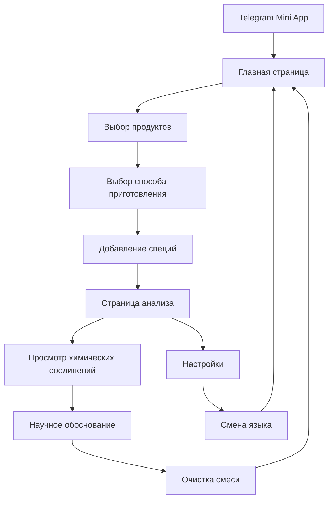

## 1. Product Overview

Интеллектуальный анализатор смесей специй - Telegram Mini App с научным обоснованием совместимости специй на основе химических соединений.

Приложение помогает пользователям создавать идеальные смеси специй для различных продуктов и способов приготовления, предоставляя научное обоснование каждого сочетания.

Целевая аудитория: домашние повара, профессиональные шеф-повара и любители кулинарии, использующие Telegram.

## 2. Core Features

### 2.1 User Roles

| Role | Registration Method | Core Permissions |
|------|---------------------|------------------|
| Telegram User | Автоматическая авторизация через Telegram WebApp | Полный доступ ко всем функциям приложения |

### 2.2 Feature Module

Наше приложение состоит из следующих основных страниц:

1. **Главная страница**: выбор продуктов, способов приготовления, облако специй с фильтрацией
2. **Страница анализа**: отображение выбранной смеси, химические соединения, научное обоснование
3. **Страница настроек**: переключение языка, информация о приложении

### 2.3 Page Details

| Page Name | Module Name | Feature description |
|-----------|-------------|---------------------|
| Главная страница | Облако продуктов | Отображение 25 продуктов в виде интерактивных тегов, выбор нескольких продуктов |
| Главная страница | Способы приготовления | Выбор из 7 методов готовки (жарка, варка, тушение и др.) |
| Главная страница | Облако специй | Отображение 96 специй с цветовой категоризацией, фильтрация по совместимости |
| Главная страница | Визуальные индикаторы | Перечеркивание несовместимых специй, подсветка выбранных элементов |
| Страница анализа | Смесь специй | Отображение выбранных специй с возможностью удаления |
| Страница анализа | Химические соединения | Анализ активных соединений в выбранных специях |
| Страница анализа | Научное обоснование | Генерация объяснения совместимости на основе химического анализа |
| Страница настроек | Переключение языка | Поддержка русского и английского языков |
| Страница настроек | Информация | Версия приложения, описание функций |

## 3. Core Process

**Основной пользовательский поток:**

1. Пользователь открывает Mini App через Telegram
2. Выбирает продукт(ы) из облака тегов
3. Выбирает способ приготовления
4. Добавляет совместимые специи в смесь (несовместимые отображаются перечеркнутыми)
5. Просматривает химический анализ и научное обоснование
6. Может очистить смесь и начать заново

```mermaid
graph TD
    A[Telegram Mini App] --> B[Главная страница]
    B --> C[Выбор продуктов]
    C --> D[Выбор способа приготовления]
    D --> E[Добавление специй]
    E --> F[Страница анализа]
    F --> G[Просмотр химических соединений]
    G --> H[Научное обоснование]
    H --> I[Очистка смеси]
    I --> B
    F --> J[Настройки]
    J --> K[Смена языка]
    K --> B
```

## 4. User Interface Design

### 4.1 Design Style

- **Основные цвета**: #4CAF50 (зеленый), #1a1a1a (темный фон)
- **Вторичные цвета**: категории специй (травы #4ade80, семена #fbbf24, корнеплоды #fb923c, перцы #ef4444, цветы #ec4899, кора #a3a3a3, ягоды #8b5cf6, орехи #d97706, экзотические #06b6d4, ароматические #7c3aed)
- **Стиль кнопок**: скругленные углы, градиентные эффекты для активных состояний
- **Шрифты**: системные шрифты, размеры 14-18px для основного текста, 20-24px для заголовков
- **Макет**: карточный дизайн, облачная компоновка тегов, адаптивная сетка
- **Иконки**: использование эмодзи для категорий (🌿 травы, 🌶️ перцы, 🥜 орехи)

### 4.2 Page Design Overview

| Page Name | Module Name | UI Elements |
|-----------|-------------|-------------|
| Главная страница | Облако продуктов | Интерактивные теги с hover-эффектами, цветовая индикация выбора |
| Главная страница | Облако специй | Цветовая категоризация, анимация перечеркивания для несовместимых |
| Страница анализа | Смесь специй | Карточки с цветными фонами, кнопки удаления |
| Страница анализа | Химические соединения | Облако тегов с научными названиями соединений |
| Страница настроек | Переключатель языка | Toggle-кнопка с флагами стран |

### 4.3 Responsiveness

Приложение оптимизировано для мобильных устройств (mobile-first), с адаптацией под различные размеры экранов Telegram Mini App. Поддержка touch-взаимодействий, свайпов и жестов.