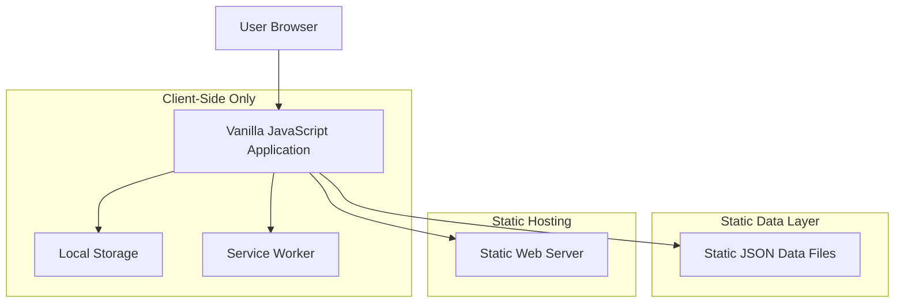
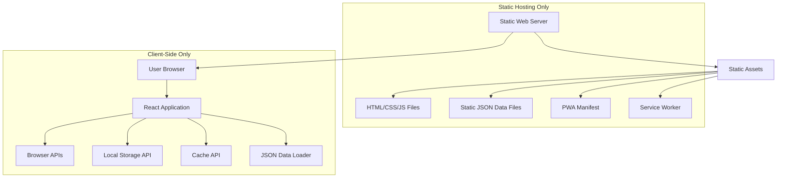
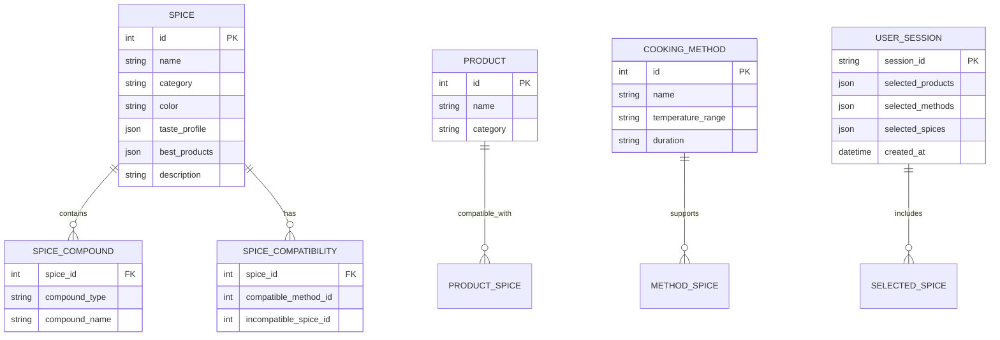

## 1.Architecture design

**ВАЖНО: Полностью статическое приложение**

Приложение разработано как полностью статический сайт, использующий только HTML, JavaScript и CSS. Никакой серверной части не требуется.



**Ключевые принципы статической архитектуры:**
- Отсутствие серверной части и баз данных
- Все данные хранятся в статических JSON файлах
- Вся логика выполняется на клиенте
- Состояние сохраняется в LocalStorage браузера
- Развертывание как статические файлы на любом веб-сервере

## 2. Technology Description

**Статический стек технологий (только клиентская часть):**

- **Frontend**: Vanilla JavaScript (ES6+) + HTML5 + CSS3
- **Hosting**: Любой статический веб-сервер (Apache, Nginx, или локальный сервер)
- **PWA**: Service Worker с автоматическим обновлением при каждом запуске
- **State Management**: Нативный JavaScript с LocalStorage
- **Локализация**: Нативная система переключения языков на JavaScript
- **Build Tool**: Отсутствует (прямая работа с HTML/CSS/JS файлами)
- **Data Storage**: Статические JSON файлы + LocalStorage браузера
- **UI Styling**: Чистый CSS3 с CSS Grid и Flexbox
- **Design System**: Минималистичный подход без брендинга

**Ограничения статической архитектуры:**
- Только HTML5, Vanilla JavaScript (ES6+), CSS3
- Отсутствие серверных API, баз данных и фреймворков
- Все вычисления выполняются в браузере нативным JavaScript
- Данные загружаются из статических JSON файлов через fetch API
- Состояние сохраняется локально в браузере через LocalStorage API
- PWA автоматически проверяет и скачивает обновления при каждом запуске

## 3. UI/UX Design Requirements

### 3.1 Дизайн-система

**Стиль дизайна:**
- **Flat Design**: Плоский дизайн без теней и градиентов
- **Минимализм**: Чистые линии, много белого пространства
- **Легковесность**: Минимальное использование графических элементов
- **Быстрая загрузка**: Оптимизация для мобильных устройств

**Цветовая палитра (Тёмная тема):**
```css
:root {
  /* Primary Colors - Dark Theme */
  --primary: #3b82f6;     /* Яркий синий */
  --primary-hover: #2563eb; /* Синий при hover */
  --secondary: #6b7280;   /* Светло-серый */
  --success: #10b981;     /* Зеленый */
  --warning: #f59e0b;     /* Оранжевый */
  --error: #ef4444;       /* Красный */
  
  /* Background Colors */
  --background: #0f172a;  /* Тёмный фон */
  --surface: #1e293b;     /* Поверхности карточек */
  --surface-hover: #334155; /* Hover состояние поверхностей */
  
  /* Text Colors */
  --text-primary: #f8fafc;   /* Основной текст */
  --text-secondary: #cbd5e1; /* Вторичный текст */
  --text-muted: #64748b;     /* Приглушённый текст */
  
  /* Border Colors */
  --border: #374151;      /* Границы */
  --border-light: #4b5563; /* Светлые границы */
}
```

### 3.2 Адаптивность и мобильная оптимизация

**Responsive Breakpoints:**
- Mobile: 320px - 768px (приоритет)
- Tablet: 768px - 1024px
- Desktop: 1024px+

**Touch-friendly интерфейс:**
- Минимальный размер кнопок: 44px × 44px
- Отступы между элементами: минимум 8px
- Swipe жесты для навигации
- Визуальная обратная связь при взаимодействии

**Производительность:**
- Lazy loading компонентов
- Виртуализация длинных списков
- Оптимизация изображений (WebP, сжатие)
- Минификация CSS и JS

### 3.3 Компонентная архитектура

**Базовые компоненты:**
```typescript
interface ButtonProps {
  variant: 'primary' | 'secondary' | 'ghost'
  size: 'sm' | 'md' | 'lg'
  fullWidth?: boolean
  disabled?: boolean
}

interface CardProps {
  padding: 'sm' | 'md' | 'lg'
  shadow?: boolean
  border?: boolean
}
```

**Tailwind CSS конфигурация:**
```javascript
module.exports = {
  theme: {
    extend: {
      fontFamily: {
        sans: ['Inter', 'system-ui', 'sans-serif']
      },
      spacing: {
        '18': '4.5rem',
        '88': '22rem'
      }
    }
  },
  plugins: [
    require('@tailwindcss/forms'),
    require('@tailwindcss/aspect-ratio')
  ]
}
```

## 3. Route definitions

**Нативная JavaScript маршрутизация (Hash-based routing):**

| Route | Purpose |
|-------|---------|
| #/ или / | Главная страница с интерактивными облаками тегов и динамическими объяснениями |
| #/settings | Настройки приложения и переключение языка |

**Реализация маршрутизации:**
```javascript
class Router {
  constructor() {
    window.addEventListener('hashchange', this.handleRoute.bind(this))
    window.addEventListener('load', this.handleRoute.bind(this))
  }
  
  handleRoute() {
    const hash = window.location.hash || '#/'
    this.renderPage(hash)
  }
  
  renderPage(route) {
    const routes = {
      '#/': () => this.renderHomePage(),
      '#/settings': () => this.renderSettingsPage()
    }
    routes[route]?.()
  }
}
```

## 4. Frontend State Management

### 4.1 Нативное управление состоянием

**JavaScript State Manager без фреймворков:**
```javascript
class AppState {
  constructor() {
    this.state = {
      selectedProducts: [],
      selectedMethods: [],
      selectedSpices: [],
      incompatibleTags: {
        products: [],
        methods: [],
        spices: []
      },
      language: 'ru',
      theme: 'dark'
    }
    this.listeners = []
    this.loadFromStorage()
  }
  
  setState(newState) {
    this.state = { ...this.state, ...newState }
    this.saveToStorage()
    this.notifyListeners()
  }
  
  subscribe(listener) {
    this.listeners.push(listener)
    return () => {
      this.listeners = this.listeners.filter(l => l !== listener)
    }
  }
  
  loadFromStorage() {
    const saved = localStorage.getItem('chi1i-bot-state')
    if (saved) {
      this.state = { ...this.state, ...JSON.parse(saved) }
    }
  }
  
  saveToStorage() {
    localStorage.setItem('chi1i-bot-state', JSON.stringify(this.state))
  }
}
```

### 4.2 PWA с автоматическим обновлением

**Service Worker с проверкой обновлений при каждом запуске:**
```javascript
class PWAUpdater {
  constructor() {
    this.registerServiceWorker()
    this.checkForUpdates()
  }
  
  async registerServiceWorker() {
    if ('serviceWorker' in navigator) {
      try {
        const registration = await navigator.serviceWorker.register('/sw.js')
        registration.addEventListener('updatefound', () => {
          this.handleUpdate(registration.installing)
        })
      } catch (error) {
        console.error('SW registration failed:', error)
      }
    }
  }
  
  async checkForUpdates() {
    if ('serviceWorker' in navigator) {
      const registration = await navigator.serviceWorker.getRegistration()
      if (registration) {
        registration.update()
      }
    }
  }
  
  handleUpdate(worker) {
    worker.addEventListener('statechange', () => {
      if (worker.state === 'installed') {
        if (navigator.serviceWorker.controller) {
          this.showUpdateNotification()
        }
      }
    })
  }
  
  showUpdateNotification() {
    if (confirm('Доступно обновление приложения. Обновить сейчас?')) {
      window.location.reload()
    }
  }
}
```

### 4.3 Browser API Integration

**Нативные браузерные API:**
```javascript
class BrowserAPI {
  constructor() {
    this.initializeApp()
  }
  
  initializeApp() {
    const config = {
      theme: this.detectTheme(),
      language: this.detectLanguage(),
      userPreferences: this.loadFromLocalStorage('preferences') || {
        selectedProducts: [],
        selectedMethods: [],
        selectedSpices: []
      }
    }
    return config
  }
  
  saveToLocalStorage(key, data) {
    try {
      localStorage.setItem(key, JSON.stringify(data))
    } catch (error) {
      console.error('LocalStorage save failed:', error)
    }
  }
  
  loadFromLocalStorage(key) {
    try {
      const data = localStorage.getItem(key)
      return data ? JSON.parse(data) : null
    } catch (error) {
      console.error('LocalStorage load failed:', error)
      return null
    }
  }
  
  detectLanguage() {
    return navigator.language.startsWith('ru') ? 'ru' : 'en'
  }
  
  detectTheme() {
    return window.matchMedia('(prefers-color-scheme: dark)').matches ? 'dark' : 'light'
  }
  
  vibrate(pattern) {
    if ('vibrate' in navigator) {
      navigator.vibrate(pattern)
    }
  }
  
  showNotification(message, type = 'info') {
    if ('Notification' in window && Notification.permission === 'granted') {
      new Notification(message)
    } else {
      this.showToast(message, type)
    }
  }
  
  showToast(message, type) {
    const toast = document.createElement('div')
    toast.className = `toast toast-${type}`
    toast.textContent = message
    document.body.appendChild(toast)
    setTimeout(() => toast.remove(), 3000)
  }
}
```

### 4.4 Data Models

**Структуры данных в JavaScript:**
```javascript
class DataModels {
  static createSpice(data) {
    return {
      id: data.id,
      name: data.name,
      category: data.category,
      color: data.color,
      chemical_compounds: {
        volatile_oils: data.chemical_compounds?.volatile_oils || [],
        phenolic_compounds: data.chemical_compounds?.phenolic_compounds || [],
        alkaloids: data.chemical_compounds?.alkaloids || []
      },
      compatible_methods: data.compatible_methods || [],
      incompatible_spices: data.incompatible_spices || [],
      taste_profile: data.taste_profile || [],
      best_products: data.best_products || [],
      description: data.description || ''
    }
  }
  
  static createProduct(data) {
    return {
      id: data.id,
      name: data.name,
      category: data.category,
      compatible_spices: data.compatible_spices || [],
      incompatible_products: data.incompatible_products || []
    }
  }
  
  static createCookingMethod(data) {
    return {
      id: data.id,
      name: data.name,
      temperature_range: data.temperature_range,
      duration: data.duration,
      compatible_spices: data.compatible_spices || [],
      incompatible_methods: data.incompatible_methods || []
    }
  }
  
  static validateData(data, type) {
    const validators = {
      spice: (item) => item.id && item.name && item.category,
      product: (item) => item.id && item.name && item.category,
      method: (item) => item.id && item.name
    }
    return validators[type]?.(data) || false
  }
}
```

## 6. Статическая архитектура (без сервера)

**ВАЖНО: Приложение полностью статическое, серверная часть отсутствует**



**Принципы статической архитектуры:**
- Все файлы статические (HTML, CSS, JS, JSON)
- Отсутствие серверной логики и баз данных
- Вся обработка данных происходит в браузере
- Использование только браузерных API
- Кэширование через Service Worker для офлайн работы

## 7. Статическое развертывание

**ВАЖНО: Полностью статическое развертывание без серверных компонентов**

### 7.1 Структура статических файлов

```
dist/ (статические файлы для веб-сервера)
├── index.html              # Главная страница (статический HTML)
├── assets/
│   ├── index-[hash].js     # Основной JS bundle (статический)
│   ├── index-[hash].css    # Стили (статический CSS)
│   └── vendor-[hash].js    # Внешние библиотеки (статический JS)
├── data/
│   ├── spices.json         # Данные о специях (статический JSON)
│   ├── products.json       # Данные о продуктах (статический JSON)
│   └── methods.json        # Методы приготовления (статический JSON)
├── icons/
│   ├── icon-192x192.png    # Иконки PWA (статические изображения)
│   └── icon-512x512.png
├── manifest.json           # PWA манифест (статический JSON)
└── sw.js                   # Service Worker (статический JS)
```

**Все файлы являются статическими и могут обслуживаться любым веб-сервером**

### 7.2 Локальная разработка и сборка

```bash
# Установка зависимостей
npm install

# Запуск локального сервера разработки
npm run dev

# Сборка для продакшена
npm run build

# Предварительный просмотр сборки
npm run preview

# Запуск простого HTTP сервера для тестирования
python -m http.server 8000 --directory dist
```

### 7.3 Конфигурация сборки

```typescript
// vite.config.ts
export default defineConfig({
  base: './',
  build: {
    outDir: 'dist',
    assetsDir: 'assets',
    rollupOptions: {
      output: {
        manualChunks: {
          vendor: ['react', 'react-dom'],
          router: ['react-router-dom']
        }
      }
    }
  },
  publicDir: 'public'
})
```

### 7.4 Требования к статическим компонентам

- **Без серверных API**: Все данные хранятся в JSON файлах
- **Клиентская маршрутизация**: React Router с Hash Router для совместимости
- **Локальное хранение**: LocalStorage для пользовательских настроек
- **Кэширование**: Service Worker для офлайн работы
- **Оптимизация**: Code splitting и lazy loading компонентов

### 7.5 Package.json конфигурация (минимальная)

```json
{
  "name": "chi1i-bot",
  "version": "1.0.0",
  "description": "Статический анализатор совместимости специй",
  "type": "module",
  "scripts": {
    "dev": "vite",
    "build": "vite build",
    "preview": "vite preview",
    "serve": "python -m http.server 8000 --directory dist",
    "validate": "node scripts/validate-json.js",
    "minify": "node scripts/minify.js"
  },
  "devDependencies": {
    "vite": "^4.0.0"
  },
  "dependencies": {},
  "keywords": ["spices", "cooking", "pwa", "vanilla-js"],
  "author": "Chi1i Bot",
  "license": "MIT"
}
```

## 8. Data model

### 8.1 Data model definition



### 8.2 Data Definition Language

**Структура данных специй (spices.json)**
```json
{
  "spices": [
    {
      "id": 1,
      "name": "Базилик",
      "category": "травы",
      "color": "#4ade80",
      "chemical_compounds": {
        "volatile_oils": ["эвгенол", "линалоол"],
        "phenolic_compounds": ["тимол", "карвакрол"],
        "alkaloids": []
      },
      "compatible_methods": [2, 4, 5, 3],
      "incompatible_spices": [15, 32],
      "taste_profile": ["ароматный", "пряный"],
      "best_products": ["мясо", "овощи", "рыба"],
      "description": "Базилик содержит эвгенол, который обладает антибактериальными свойствами."
    }
  ]
}
```

**Структура данных продуктов (products.json)**
```json
{
  "products": [
    {
      "id": 1,
      "name": "Говядина",
      "category": "мясо",
      "compatible_spices": [1, 2, 3, 4, 19, 20]
    }
  ]
}
```

**Структура методов приготовления (cooking-methods.json)**
```json
{
  "cookingMethods": [
    {
      "id": 1,
      "name": "Сырое",
      "temperature_range": "комнатная",
      "duration": "без готовки",
      "compatible_spices": [6, 7, 25, 41]
    }
  ]
}
```

**Local Storage Schema**
```typescript
interface AppState {
  selectedProducts: number[];
  selectedMethods: number[];
  blendSpices: number[];
  language: 'ru' | 'en';
  theme: 'light' | 'dark';
}
**Service Worker с автоматическим обновлением:**
```javascript
const CACHE_NAME = 'chi1i-bot-v1'
const urlsToCache = [
  '/',
  '/index.html',
  '/css/styles.css',
  '/js/app.js',
  '/js/router.js',
  '/js/state.js',
  '/data/spices.json',
  '/data/products.json',
  '/data/cooking-methods.json',
  '/manifest.json'
]

self.addEventListener('install', event => {
  event.waitUntil(
    caches.open(CACHE_NAME)
      .then(cache => {
        console.log('Opened cache')
        return cache.addAll(urlsToCache)
      })
  )
  self.skipWaiting()
})

self.addEventListener('activate', event => {
  event.waitUntil(
    caches.keys().then(cacheNames => {
      return Promise.all(
        cacheNames.map(cacheName => {
          if (cacheName !== CACHE_NAME) {
            console.log('Deleting old cache:', cacheName)
            return caches.delete(cacheName)
          }
        })
      )
    })
  )
  self.clients.claim()
})

self.addEventListener('fetch', event => {
  event.respondWith(
    caches.match(event.request)
      .then(response => {
        if (response) {
          return response
        }
        return fetch(event.request)
      })
  )
})

self.addEventListener('message', event => {
  if (event.data && event.data.type === 'SKIP_WAITING') {
    self.skipWaiting()
  }
})
```

## История изменений

### Январь 2025

**Основные обновления:**
- ✅ Обновлен стек технологий (Zustand вместо Context API)
- ✅ Добавлены типы для взаимоисключений
- ✅ Описана логика MutualExclusionEngine
- ✅ Обновлены интерфейсы для химических реакций
- ✅ Убраны упоминания брендинга
- ✅ Убран GitHub Pages деплой, заменен на общий статический хостинг

**Новые технические функции:**
- **Система взаимоисключений**: Автоматическая деактивация несовместимых элементов
- **Подробные научные обоснования**: Алгоритмы анализа химических процессов
- **Минималистичный подход**: Упрощенная архитектура без лишних компонентов