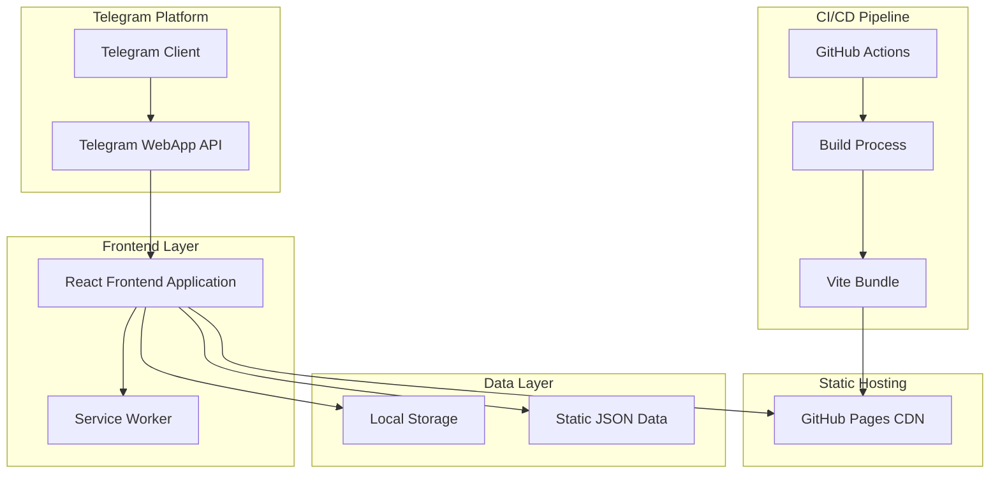
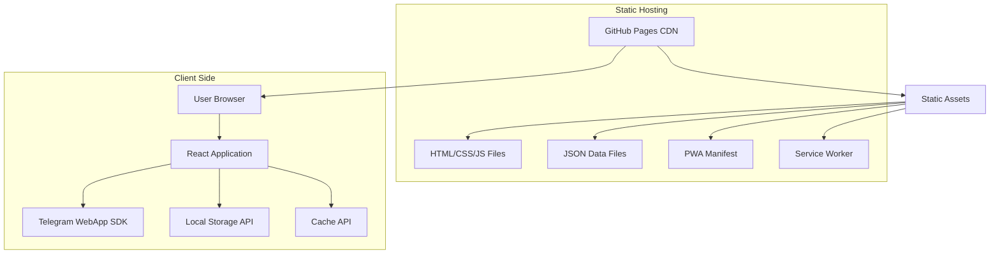
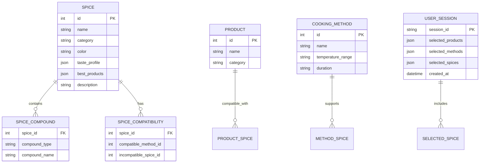

## 1. Architecture design


```mermaid
graph TD
    A[Telegram Client] --> B[Telegram WebApp API]
    B --> C[React Frontend Application]
    C --> D[GitHub Pages CDN]
    C --> E[Local Storage]
    C --> F[Service Worker]
    C --> G[Static JSON Data]
    
    H[GitHub Actions] --> I[Build Process]
    I --> J[Vite Bundle]
    J --> D
    
    subgraph "Telegram Platform"
        A
        B
    end
    
    subgraph "Frontend Layer"
        C
        F
    end
    
    subgraph "Data Layer"
        E
        G
    end
    
    subgraph "Static Hosting"
        D
    end
    
    subgraph "CI/CD Pipeline"
        H
        I
        J
    end
```

## 2. Technology Description

- Frontend: React@18 + TypeScript + Vite + Tailwind CSS
- Telegram Integration: @twa-dev/sdk для Telegram WebApp API
- Hosting: GitHub Pages (статический хостинг)
- PWA: Service Worker для кэширования и офлайн работы
- State Management: React Context API
- Локализация: react-i18next
- Build Tool: Vite для оптимизации статических файлов
- Data Storage: JSON файлы + LocalStorage (без серверной БД)
- UI Framework: Tailwind CSS для легковесного дизайна
- Design System: Flat Design с минималистичным подходом

## 3. UI/UX Design Requirements

### 3.1 Дизайн-система

**Стиль дизайна:**
- **Flat Design**: Плоский дизайн без теней и градиентов
- **Минимализм**: Чистые линии, много белого пространства
- **Легковесность**: Минимальное использование графических элементов
- **Быстрая загрузка**: Оптимизация для мобильных устройств

**Цветовая палитра:**
```css
:root {
  --primary: #2563eb;     /* Синий */
  --secondary: #64748b;   /* Серый */
  --success: #10b981;     /* Зеленый */
  --warning: #f59e0b;     /* Оранжевый */
  --error: #ef4444;       /* Красный */
  --background: #ffffff;  /* Белый фон */
  --surface: #f8fafc;     /* Светло-серый */
  --text: #1e293b;        /* Темно-серый текст */
}
```

### 3.2 Адаптивность и мобильная оптимизация

**Responsive Breakpoints:**
- Mobile: 320px - 768px (приоритет)
- Tablet: 768px - 1024px
- Desktop: 1024px+

**Touch-friendly интерфейс:**
- Минимальный размер кнопок: 44px × 44px
- Отступы между элементами: минимум 8px
- Swipe жесты для навигации
- Haptic feedback через Telegram WebApp API

**Производительность:**
- Lazy loading компонентов
- Виртуализация длинных списков
- Оптимизация изображений (WebP, сжатие)
- Минификация CSS и JS

### 3.3 Компонентная архитектура

**Базовые компоненты:**
```typescript
interface ButtonProps {
  variant: 'primary' | 'secondary' | 'ghost'
  size: 'sm' | 'md' | 'lg'
  fullWidth?: boolean
  disabled?: boolean
}

interface CardProps {
  padding: 'sm' | 'md' | 'lg'
  shadow?: boolean
  border?: boolean
}
```

**Tailwind CSS конфигурация:**
```javascript
module.exports = {
  theme: {
    extend: {
      fontFamily: {
        sans: ['Inter', 'system-ui', 'sans-serif']
      },
      spacing: {
        '18': '4.5rem',
        '88': '22rem'
      }
    }
  },
  plugins: [
    require('@tailwindcss/forms'),
    require('@tailwindcss/aspect-ratio')
  ]
}
```

## 4. Route definitions

| Route | Purpose |
|-------|---------|
| / | Главная страница с выбором продуктов, методов и специй |
| /analysis | Страница анализа смеси с химическими соединениями |
| /settings | Настройки приложения и переключение языка |

## 5. API definitions

### 5.1 Telegram WebApp API Integration

**Инициализация приложения**
```typescript
interface TelegramWebApp {
  initData: string;
  initDataUnsafe: {
    user?: {
      id: number;
      first_name: string;
      last_name?: string;
      username?: string;
      language_code?: string;
    };
  };
  colorScheme: 'light' | 'dark';
  themeParams: {
    bg_color: string;
    text_color: string;
    hint_color: string;
    link_color: string;
    button_color: string;
    button_text_color: string;
  };
}
```

**Методы взаимодействия с Telegram**
```typescript
interface TelegramMethods {
  ready(): void;
  expand(): void;
  close(): void;
  MainButton: {
    text: string;
    color: string;
    textColor: string;
    isVisible: boolean;
    isActive: boolean;
    show(): void;
    hide(): void;
    enable(): void;
    disable(): void;
    onClick(callback: () => void): void;
  };
  HapticFeedback: {
    impactOccurred(style: 'light' | 'medium' | 'heavy' | 'rigid' | 'soft'): void;
    notificationOccurred(type: 'error' | 'success' | 'warning'): void;
    selectionChanged(): void;
  };
}
```

### 5.2 Data Models

**Spice Model**
```typescript
interface Spice {
  id: number;
  name: string;
  category: string;
  color: string;
  chemical_compounds: {
    volatile_oils: string[];
    phenolic_compounds: string[];
    alkaloids: string[];
  };
  compatible_methods: number[];
  incompatible_spices: number[];
  taste_profile: string[];
  best_products: string[];
  description: string;
}
```

**Product Model**
```typescript
interface Product {
  id: number;
  name: string;
  category: string;
  compatible_spices: number[];
}
```

**Cooking Method Model**
```typescript
interface CookingMethod {
  id: number;
  name: string;
  temperature_range: string;
  duration: string;
  compatible_spices: number[];
}
```

## 6. Server architecture diagram


```mermaid
graph TD
    A[GitHub Pages CDN] --> B[Static Assets]
    B --> C[HTML/CSS/JS Files]
    B --> D[JSON Data Files]
    B --> E[PWA Manifest]
    B --> F[Service Worker]
    
    subgraph "Static Hosting"
        A
        C
        D
        E
        F
    end
    
    G[User Browser] --> H[React Application]
    H --> I[Telegram WebApp SDK]
    H --> J[Local Storage API]
    H --> K[Cache API]
    
    subgraph "Client Side"
        G
        H
        I
        J
        K
    end
    
    A --> G
```

## 7. GitHub Pages Configuration

### 7.1 Структура статических файлов

```
dist/
├── index.html              # Главная страница
├── assets/
│   ├── index-[hash].js     # Основной JS bundle
│   ├── index-[hash].css    # Стили
│   └── vendor-[hash].js    # Внешние библиотеки
├── data/
│   ├── spices.json         # Данные о специях
│   ├── products.json       # Данные о продуктах
│   └── methods.json        # Методы приготовления
├── icons/
│   ├── icon-192x192.png
│   └── icon-512x512.png
├── manifest.json           # PWA манифест
└── sw.js                   # Service Worker
```

### 7.2 GitHub Actions для автодеплоя

```yaml
name: Deploy to GitHub Pages

on:
  push:
    branches: [ main ]
  pull_request:
    branches: [ main ]

jobs:
  build-and-deploy:
    runs-on: ubuntu-latest
    steps:
    - uses: actions/checkout@v3
    
    - name: Setup Node.js
      uses: actions/setup-node@v3
      with:
        node-version: '18'
        cache: 'npm'
    
    - name: Install dependencies
      run: npm ci
    
    - name: Build
      run: npm run build
    
    - name: Deploy to GitHub Pages
      uses: peaceiris/actions-gh-pages@v3
      with:
        github_token: ${{ secrets.GITHUB_TOKEN }}
        publish_dir: ./dist
```

### 7.3 Vite конфигурация для GitHub Pages

```typescript
// vite.config.ts
export default defineConfig({
  base: '/chi1i-bot/',
  build: {
    outDir: 'dist',
    assetsDir: 'assets',
    rollupOptions: {
      output: {
        manualChunks: {
          vendor: ['react', 'react-dom'],
          telegram: ['@twa-dev/sdk']
        }
      }
    }
  },
  publicDir: 'public'
})
```

### 7.4 Требования к статическим компонентам

- **Без серверных API**: Все данные хранятся в JSON файлах
- **Клиентская маршрутизация**: React Router с Hash Router для GitHub Pages
- **Локальное хранение**: LocalStorage для пользовательских настроек
- **Кэширование**: Service Worker для офлайн работы
- **Оптимизация**: Code splitting и lazy loading компонентов

### 7.5 Package.json конфигурация

```json
{
  "name": "chi1i-bot",
  "type": "module",
  "scripts": {
    "dev": "vite",
    "build": "tsc && vite build",
    "preview": "vite preview",
    "deploy": "npm run build && gh-pages -d dist"
  },
  "dependencies": {
    "react": "^18.2.0",
    "react-dom": "^18.2.0",
    "react-router-dom": "^6.8.0",
    "@twa-dev/sdk": "^6.9.0",
    "react-i18next": "^12.1.0"
  },
  "devDependencies": {
    "@types/react": "^18.0.27",
    "@types/react-dom": "^18.0.10",
    "@vitejs/plugin-react": "^3.1.0",
    "typescript": "^4.9.4",
    "vite": "^4.1.0",
    "tailwindcss": "^3.2.0",
    "gh-pages": "^5.0.0"
  }
}
```

## 8. Data model

### 8.1 Data model definition


```mermaid
erDiagram
    SPICE ||--o{ SPICE_COMPOUND : contains
    SPICE ||--o{ SPICE_COMPATIBILITY : has
    PRODUCT ||--o{ PRODUCT_SPICE : compatible_with
    COOKING_METHOD ||--o{ METHOD_SPICE : supports
    USER_SESSION ||--o{ SELECTED_SPICE : includes
    
    SPICE {
        int id PK
        string name
        string category
        string color
        json taste_profile
        json best_products
        string description
    }
    
    SPICE_COMPOUND {
        int spice_id FK
        string compound_type
        string compound_name
    }
    
    SPICE_COMPATIBILITY {
        int spice_id FK
        int compatible_method_id
        int incompatible_spice_id
    }
    
    PRODUCT {
        int id PK
        string name
        string category
    }
    
    COOKING_METHOD {
        int id PK
        string name
        string temperature_range
        string duration
    }
    
    USER_SESSION {
        string session_id PK
        json selected_products
        json selected_methods
        json selected_spices
        datetime created_at
    }
```

### 8.2 Data Definition Language

**Структура данных специй (spices.json)**
```json
{
  "spices": [
    {
      "id": 1,
      "name": "Базилик",
      "category": "травы",
      "color": "#4ade80",
      "chemical_compounds": {
        "volatile_oils": ["эвгенол", "линалоол"],
        "phenolic_compounds": ["тимол", "карвакрол"],
        "alkaloids": []
      },
      "compatible_methods": [2, 4, 5, 3],
      "incompatible_spices": [15, 32],
      "taste_profile": ["ароматный", "пряный"],
      "best_products": ["мясо", "овощи", "рыба"],
      "description": "Базилик содержит эвгенол, который обладает антибактериальными свойствами."
    }
  ]
}
```

**Структура данных продуктов (products.json)**
```json
{
  "products": [
    {
      "id": 1,
      "name": "Говядина",
      "category": "мясо",
      "compatible_spices": [1, 2, 3, 4, 19, 20]
    }
  ]
}
```

**Структура методов приготовления (cooking-methods.json)**
```json
{
  "cookingMethods": [
    {
      "id": 1,
      "name": "Сырое",
      "temperature_range": "комнатная",
      "duration": "без готовки",
      "compatible_spices": [6, 7, 25, 41]
    }
  ]
}
```

**Local Storage Schema**
```typescript
interface AppState {
  selectedProducts: number[];
  selectedMethods: number[];
  blendSpices: number[];
  language: 'ru' | 'en';
  theme: 'light' | 'dark';
}
```

**Service Worker Cache Strategy**
```typescript
const CACHE_NAME = 'spice-analyzer-v1';
const urlsToCache = [
  '/',
  '/static/js/bundle.js',
  '/static/css/main.css',
  '/data/spices.json',
  '/data/products.json',
  '/data/cooking-methods.json'
];
